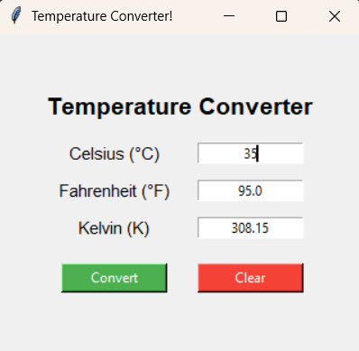
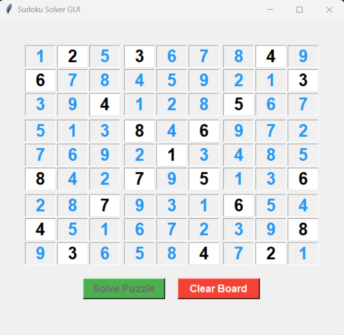
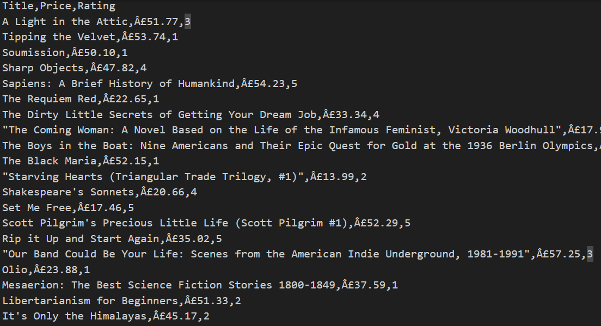

# 🚀 SkillCraft Technology – Software Development Internship Tasks


## 📌 Overview

This repository contains all **4 completed tasks** from my **Software Development Internship at SkillCraft Technology**.

Each task focuses on strengthening **Python programming, GUI development, problem solving, and real-world application building skills**.

The projects included demonstrate:

* GUI application development using **Tkinter**
* Algorithm implementation using **Backtracking**
* Web scraping using **BeautifulSoup**
* Data handling using **Pandas**
* Clean modular project structure
* Documentation and version control best practices

---

# 📸 Project Previews

| Task | Preview |
|------|--------|
| Temperature Converter |  |
| Number Guessing Game |  |
| Sudoku Solver |  |
| Book Scraper |  |

---

# 📂 Repository Structure

```
SkillCraft-Internship-Tasks/
│
├── SCT-SD-1  → Temperature Converter (GUI App)
├── SCT-SD-2  → Number Guessing Game (GUI App)
├── SCT-SD-3  → Sudoku Solver GUI (Backtracking Algorithm)
├── SCT-SD-4  → Multi-Page Book Data Scraper (Web Scraping Project)
│
├── .gitignore
├── README.md
└── LICENSE
```

---

# 🧩 Internship Tasks

## ✅ Task 1 – Temperature Converter (GUI Application)

A user-friendly temperature conversion tool built using **Python Tkinter**.

### Features

* Convert temperatures between **Celsius, Fahrenheit, and Kelvin**
* Interactive GUI interface
* Input validation with error handling
* Clean and responsive layout

📁 Folder: `SCT-SD-1`

---

## 🎯 Task 2 – Number Guessing Game (GUI Application)

A fun interactive number guessing game with difficulty levels.

### Features

* Random number generation
* Multiple difficulty levels
* Attempt tracking system
* Real-time feedback messages
* GUI-based gameplay experience

📁 Folder: `SCT-SD-2`

---

## ♟ Task 3 – Sudoku Solver GUI (Backtracking Algorithm)

A fully functional **Sudoku Solver** using the **Backtracking Algorithm** with an interactive GUI.

### Features

* Accepts custom Sudoku input
* Automatically solves puzzle
* Uses optimized backtracking logic
* Input validation support
* Modular architecture:

```
constants.py
validator.py
solver.py
gui.py
main.py
```

📁 Folder: `SCT-SD-3`

---

## 📚 Task 4 – Multi-Page Book Data Scraper (Web Scraping Project)

A Python-based scraper that extracts structured product data from a multi-page e-commerce website.

### Features

* Multi-page scraping support
* Extracts:

  * Book Title
  * Price
  * Rating
* Converts rating text → numeric values
* Exports dataset to CSV
* Uses:

  * requests
  * BeautifulSoup
  * pandas

📁 Folder: `SCT-SD-4`

---

# 🛠 Technologies Used

Throughout this internship, I worked with:

* Python
* Tkinter
* BeautifulSoup
* Requests
* Pandas
* Backtracking Algorithm
* CSV Data Processing
* Git & GitHub

---

# 🎯 Learning Outcomes

During this internship, I gained hands-on experience in:

* Building real-world Python GUI applications
* Implementing algorithms for problem solving
* Performing multi-page web scraping
* Writing clean and modular Python code
* Exporting structured datasets
* Managing projects using GitHub
* Writing professional documentation

---

# 📸 Screenshots

Each project folder contains its own **screenshots** demonstrating the application interface and outputs.

---

# 🚀 How to Run Projects

Clone this repository:

```
git clone https://github.com/BhaveshV23/SkillCraft-Internship-Tasks.git
```

Navigate to any task folder:

```
cd SkillCraft-Internship-Tasks/SCT-SD-X
```

Install dependencies (if required):

```
pip install -r requirements.txt
```

Run the project:

```
python main.py
```

---

# 👨‍💻 Author

**Bhavesh Vadnere**

Information Technology Student

Python Developer | Aspiring AI/ML Engineer

🔗 GitHub: [https://github.com/BhaveshV23](https://github.com/BhaveshV23)

🔗 LinkedIn: [https://linkedin.com/in/bhavesh-vadnere](https://linkedin.com/in/bhavesh-vadnere)

---

# 📢 Internship Completion Summary

Successfully completed all assigned tasks as part of the **SkillCraft Technology Software Development Internship**, demonstrating practical skills in:

* GUI Development
* Algorithm Design
* Web Scraping
* Data Processing
* Documentation
* Version Control

This repository represents my internship learning journey and project implementations.

---

# ⭐ Support

If you found this repository helpful or interesting:

Give it a ⭐ on GitHub!
