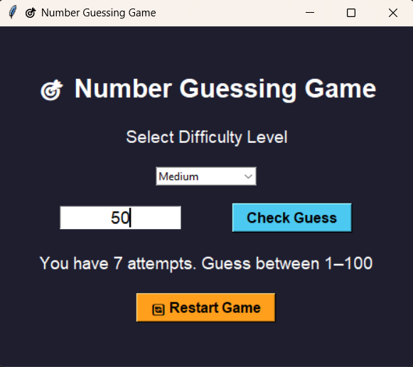

# 🎯 Number Guessing Game – Python Tkinter GUI


An interactive **Number Guessing Game** desktop application built using Python and the Tkinter GUI library. 

The game challenges users to guess a randomly generated number between **1 and 100** within a limited number of attempts based on a selected difficulty level. This project demonstrates GUI development, event handling, input validation, game logic implementation, and user interaction design.

---

## 📌 Features

✅ Clean and interactive Tkinter GUI

✅ Difficulty levels: Easy, Medium, Hard

✅ Smart attempt tracking system

✅ Real-time feedback (Too High / Too Low)

✅ Input validation with warning dialogs

✅ Restart game functionality

✅ Keyboard shortcut support (Press Enter to submit guess)

✅ User-friendly colored hints and messages

---

## 🖥️ Preview



---

## 🎮 Difficulty Levels

| Level | Attempts | Description |
| :--- | :--- | :--- |
| **Easy** | 10 Attempts | Great for beginners. |
| **Medium** | 7 Attempts | The standard challenge. |
| **Hard** | 5 Attempts | For the masters of deduction. |

---

## 🧠 How the Game Works

1.  **Select Difficulty:** Use the dropdown menu to set your challenge level.
2.  **Input Guess:** Enter a number between 1 and 100.
3.  **Receive Hints:**
    * 📉 **Too High:** Your guess is above the target.
    * 📈 **Too Low:** Your guess is below the target.
    * 🎉 **Correct Guess:** You found the number!
4.  **Win or Lose:** Win by finding the number before attempts run out. If attempts reach zero:
    * 💀 **Game Over:** The secret number is revealed.

---

## 🛠️ Technologies Used

* **Python**
* **Tkinter** (GUI Framework)
* **ttk Widgets** (Themed components)
* **Random Module** (Logic generation)
* **Messagebox Dialogs** (Pop-up alerts)

---

## 📂 Project Structure

```text
Number-Guessing-Game
│
├── number_guessing_game.py   # Main application logic
├── screenshots/
└── README.md                 # Project documentation
```

---

## ▶️ How to Run the Project

Step 1: Clone the Repository
```
git clone https://github.com/BhaveshV23/SkillCraft-Internship-Tasks.git
```
Step 2: Navigate into Project Folder
```
cd SkillCraft-Internship-Tasks/SCT-SD-2
```
Step 3: Run the Application
```
python main.py
```

---

## 🎯 Learning Outcomes

- GUI design using Tkinter
- Event-driven programming
- Input validation techniques
- Game logic structuring
- State management in desktop apps
- Python function modularization

---

## 🚀 Future Improvements

🏆 Leaderboard: Save high scores to a local file or database.

⏱️ Timer Mode: Add a countdown timer for extra pressure.

🎵 Audio: Add sound effects for wins, losses, and clicks.

🌗 Themes: Toggle between Light and Dark modes.

📦 Standalone App: Convert the script into a .exe for Windows.

---

## 👨‍💻 Author

**Bhavesh Vadnere**

Information Technology Student

Python Developer | Aspiring AI/ML Engineer

GitHub: https://github.com/BhaveshV23

LinkedIn: https://linkedin.com/in/bhavesh-vadnere

---

## 📜 License

This project is open-source and available under the MIT License.

⭐ If you found this project useful, consider giving it a **star on GitHub**!
